# Capability based Access Control in `p2panda` [under review]

# Introduction

This document describes an access control system for the [p2panda protocol](https://p2panda.org) which gives peers fine grained control over who can read their data, and what actions they are authorized to perform on it. The system must take account of the particular challenges faced as a result of supporting offline-first functionality and delay tolerant networking.

# Background

Peer-to-peer protocols such as p2panda use public-key cryptography and digital signatures to establish the identity of peers and the authenticity of messages replicated on a network. Any peer can verify that messages it receives were created by the claimed peer (public key), and that they have not been tampered with by any third parties. This allows peers to replicate messages freely, safe in the knowledge that if tampering occurs it can be detected.

What if we don't want to share data with anyone though? Even if we know it won't be tampered with, we may want a stricter system where an author has additional control over where their data can travel, and how peers are allowed to interact with it. If we understand "authorship" as equal to "ownership" then we can say that only an owner has "read" and "write" authority over the data they created ("write" authority being relevant to long-lived mutable data).

This results in a system with strict restrictions on who has access to data on the network, in fact in the scenario described above no data would travel on the network at all, which in healthy and collaborative communities is of course not the desired behavior. In this document we will describe mechanisms for opening up such a system, with a protocol for delegating fine-grained and bounded access control to other peers.

# Overview

Following design patterns found in the field of capability-based security we describe a token based capability system with which peers can delegate the authority to access and perform actions on their owned resources. The features we require are very close to those provided by [UCAN](https://ucan.xyz/)s, although our implementation will not be inter-operable, we have incorporated their specification into our designs where possible.

## Notable challenges

p2panda is a peer-to-peer protocol with first class support for offline-first functionality. We make very few assumptions about the nature of the network messages are carried on, delays and temporary partitions are expected (a property often referred to as delay tolerance) and messages may arrive out-of-order. Accounting for these properties presents some challenges when designing a suitable access control system.

In centralized, and many decentralized, access control systems it is assumed that a connection between the "authorizer" and "requester" is present at the moment when an action request is being made. In a peer-to-peer system where peers are often offline and messages are gossiped through the network this assumption cannot be made. Equally, access to resources is typically limited to certain time ranges, however in a delay tolerant setting authorized messages may be received many days, weeks, or even months after they were created. Our system offers solutions for these challenges while retaining the security guarantees expected from systems following least-authority principals.

## Design goals

- authors have fine-grained control over who can access and perform actions on their data
- delay tolerant networking and offline-first operation supported
- authority can be delegated and revoked
- role based access control patterns can be modeled
- hierarchical and "flat" ownership structures can be modeled
- modular system with features which can be incrementally supported

## Supported access control structures

A requirement of our system is that it allows developers to build apps which model both "flat" and hierarchical ownership structures with suitable access control boundaries.

The below diagram sketches the access control boundaries for a festival and it's schedule of events. The application data has hierarchical ownership structure. There is an admin group which owns the festival and collection of events, organisers are delegated `collection/add` authority so they can add events to the collection, they own any events they create. Visitors are given `document/read` authority for the festival info and all it's events.

```
owner=admins────────────────────────┐
visitor:read                        │
│                                   │
│          FESTIVAL INFO            │
│                                   │
│    owner=admins──────────────┐    │
│    organiser:add             │    │
│    │                         │    │
│    │         EVENTS          │    │
│    │                         │    │
│    │   owner=organiser───┐   │    │
│    │   │                 │   │    │
│    │   │      EVENT      │   │    │
│    │   │                 │   │    │
│    │   └─────────────────┘   │    │
│    │                         │    │
│    │   owner=organiser───┐   │    │
│    │   │                 │   │    │
│    │   │      EVENT      │   │    │
│    │   │                 │   │    │
│    │   └─────────────────┘   │    │
│    │                         │    │
│    │   owner=organiser───┐   │    │
│    │   │                 │   │    │
│    │   │      EVENT      │   │    │
│    │   │                 │   │    │
│    │   └─────────────────┘   │    │
│    │                         │    │
│    │                         │    │
│    └─────────────────────────┘    │
│                                   │
└───────────────────────────────────┘
```

In the following diagram we can see how non-hierarchical ownership can be modeled with a photo sharing app. The app displays to the user a collection of photos, this isn't an "owned" collection as no peer has overall authority over it, each user will have their own photo collection. All they need is `read` authority for any published photos.

```
owner=anna─────────┐   owner=billie───────┐
me:read            │   me:read            │
│                  │   │                  │
│      PHOTO       │   │      PHOTO       │
│                  │   │                  │
│                  │   │                  │
└──────────────────┘   └──────────────────┘

owner=claire───────┐   owner=diana────────┐
me:read            │   me:read            │
│                  │   │                  │
│      PHOTO       │   │      PHOTO       │
│                  │   │                  │
│                  │   │                  │
└──────────────────┘   └──────────────────┘
```

# System context assumptions

We assume a system where resources can be referenced by unique identifiers (for example, via content hashes) and messages between peers are signed using public key cryptography. Optionally, messages can form append-only logs (by including sequence number and backlinks) so as to provide verifiable causal ordering and stricter capability condition restrictions.

# Definitions

**peer:** a user possessing knowledge of the private key for an ed25519 signing keypair; publishes operations and syncs document state with other peers  
**owner:** the peer who created a document  
**issuer:** the peer issuing authority via a capability  
**receiver:** the peer receiving authority via a capability  
**authorizer:** the peer authorizing a request or operation against a capability  
**invoker** the peer attempting to use the authority a capability delegates (by publishing operations or syncing documents)  
**document:** a uniquely identifiable resource which capabilities are associated with  
**operation:** messages peers publish to the network containing changes to documents, require that suitable authority is demonstrated before being accepted by another peer  
**collection:** a collection of documents  
**group:** a group of authors (public keys) which can be the owner of a document, and receiver of a capability  
**schema:** description of a documents' format, is addressable by a unique schema id  

# Capability

| Field        | Type                          | Required | Description                                             |
| ------------ | ----------------------------- | -------- | ------------------------------------------------------- |
| `issuer`     | `PublicKey`                   | Yes      | Public key of the issuing author                        |
| `receiver`   | `PublicKey` / `GroupId` / `*` | Yes      | The receiver of this capability                         |
| `subject`    | `PublicKey`                   | Yes      | The initial (root) issuer in any capability chain       |
| `action`     | `String`                      | Yes      | The action a capability gives authority to perform      |
| `conditions` | `Conditions`                  | Yes      | Conditions which restrict this capability               |
| `not_before` | `Integer`                     | No       | "Not before" UTC Unix Timestamp in seconds (valid from) |
| `expires`    | `Integer`                     | No       | Expiration UTC Unix Timestamp in seconds (valid until)  |

## `issuer`

Peer issuing a capability identified by their public key. May be the original owner of a resource (in which case the public key must match the `subject`) or a peer issuing a capability delegation.

Even if a peer receives a capability due to being the member of a group (receive contains a group id), then further delegations are issued using their public key as issuer. When validating delegation chains including delegations to a group, current membership of the group must be confirmed for the `issuer` public key.

## `receiver`

The receiver of a capability can be an individual peer identified by their public key, a group of peers identified by a group id (all members of the group receive authority) or the wildcard symbol `*` which signifies _any_ peer is authorized to perform the action described by this capability.

If a `receiver` is defined by a group id then an `authorizer` must be able to resolve the group to a list of public keys containing only the current group members. The public key of any `invoker` must be a member of this group.

If the `receiver` contains wildcard symbol `*` then this capability can be invoked by _any_ peer.

## `subject`

Peer who is the owner of the resource this capability targets and therefore the root of any delegation chain.

## `action`

Action a capability gives authority to perform. Can be any string value using `/` as separator between arguments, initially supported values are:

### Read actions

- `document/read`: read and sync a document

### Write actions

- `document/write`: write to a document
- `document/delete`: delete a document
- `collection/add`: add documents to a collection
- `collection/remove`: remove documents from a collection
- `group/add`: add members to a group
- `group/remove`: remove members from a group
- `capability/issue`: issue capabilities
- `capability/revoke`: revoke capabilities

Actions can be application specific with desired level of granularity. For example, if a document contains a Yjs CRDT Map, you may want to authorize peers to only be able to write to one key. This could be achieved by introducing the action `ycrdt/write/<KEY>`, where `KEY` is the only field allowed to write to. This could be coupled with custom document methods and validation logic in order to implement capabilities providing a granularity of access control which is finer than the document boundary itself.

## `conditions`

Conditions are how the authority a capability delegates is bounded, adding conditions can restrict a capability along several parameters. Supported conditions are:

| Field            | Type         | Action     | Required | Description                                                       |
| ---------------- | ------------ | ---------- | -------- | ----------------------------------------------------------------- |
| `document_ids`   | `[Hash]`     | read/write | No       | List document ids this capability applies to                      |
| `schema_ids`     | `[SchemaId]` | read/write | No       | List of schema ids this capability applies to                     |
| `to_timestamp`   | `Integer`    | read/write | No       | The timestamp until which read/write of operations is authorized  |
| `from_timestamp` | `Integer`    | read/write | No       | The timestamp from which read/write of operations is authorized   |
| `to_seq`         | `Integer`    | write      | No       | The seq number until which read/write of operations is authorized |
| `from_seq`       | `Integer`    | write      | No       | The seq number from which read/write of operations is authorized  |

### Empty conditions

If the conditions are empty then the action contained in the capability is authorized for any document owned by the `subject` &/ `issuer`.

```json
{
  //...
  "action": "document/read",
  "conditions": {}
}
```

### `document_ids`

Including `document_ids` in a capabilities conditions restricts the authority scope to only the listed documents. The type of document is not specified (it can be a single document, a collection or a group) but the action a capability contains must be compatible with the type of documents targeted.

```json
{
  //...
  "action": "document/update",
  "conditions": { "document_ids": ["0A01.."] }
}
```

The above capability gives authority to update only document `"0A01.."`.

### `schema_ids`

Including `schema_ids` in a capabilities conditions restricts the authority scope to only documents following the specified schemas.

```json
{
  //...
  "action": "document/update",
  "conditions": { "schema_ids": ["events_0A01..", "resources_0B02.."] }
}
```

The above capability gives authority to update any documents which are `"events"` or `"resources"`.

### `to_timestamp`

Including `to_timestamp` restricts a capabilities authority to only operations which contain a lower `timestamp` in their header.

```json
{
  //...
  "action": "document/update",
  "conditions": {
    "document_ids": ["0A01.."],
    "to_timestamp": 1712226632
  }
}
```

The above capability restricts authority to document `"0A01"` and only operations containing a timestamp `<=` `1712226632`.

At first glance it may seem that this (and the following `from_timestamp`) condition is duplicating behaviour achievable via a capabilities `expires` and `not_before` field. However on closer consideration we can see how these two fields can be configured to support network specific degrees of delay tolerance while still retaining recommended "least authority" practices. To demonstrate this we can use an example where a network delay of one day is tolerated. In this situation we can expect that after one day has passed all peers should have received all published operations for all documents they replicate (and have `document/read` capabilities for). For this network we might issue capabilities with the following values:

```json
{
  //...
  "expires": 1712310016, // one day later than to_timestamp
  "action": "document/update",
  "conditions": {
    "document_ids": ["0A01.."],
    "to_timestamp": 1712226632 // one day before expires
  }
}
```

By including an `"expires"` field which contains a timestamp one day ahead of the `"to_timestamp"` condition we are allowing operations within the capabilities scope to arrive up to one day late, but no longer. After `"expires"` has passed we can reject updates from authors depending on this capability, even if they would have fallen within the authorised scope. Correct configuration of this behaviour requires an understanding of the networks you will be using and the degree of delay you wish to tolerate. Misconfiguration has the potential to artificially introduce network partitions, where one peer accepted operations which another never received, however the capability used has now expired. This "deadlock" is expected to be resolved when new capabilities are issued, or if the operations are due for garbage collection in any case.

### `from_timestamp`

Including `from_timestamp` restricts a capabilities authority to only operations' which contain a greater `timestamp` in their header.

```json
{
  //...
  "action": "document/update",
  "conditions": {
    "document_ids": ["0A01.."],
    "from_timestamp": 1712226632
  }
}
```

The above capability restricts authority to document `"0A01"` and only operations containing a timestamp `>` `1712226632`.

### `to_seq`

Including `to_seq` restricts a capabilities authority to only operations' which contain a lower `timestamp` in their header.

An authors contributions to a document contain a monotonically increasing sequence number. By leveraging this property we can introduce a more strictly bounded authority than is possible when using timestamps.

```json
{
  //...
  "action": "document/update",
  "conditions": {
    "document_ids": ["0A01.."],
    "to_seq": 100
  }
}
```

The above capability restricts authority to document `"0A01"` and only operations containing a sequence number `<` 100. Effectively this capability allows a maximum of 100 operations to be published to a document.

### `from_seq`

Including `from_seq` restricts a capabilities authority to only operations' which contain a greater `timestamp` in their header.

### `not_before`

The UTC Unix Timestamp in milliseconds specifying at which point this capability becomes valid.

### `expires`

The UTC Unix Timestamp in milliseconds specifying at which point this capability expires.

Although this field is optional, it is highly recommended that one includes an expiry for most capabilities. The exception for this is when issuing capabilities containing a restriction based on an operations sequence number. As this is a securely bounded condition, with measures in place at a protocol level to detect potentially malicious behavior, then expiry can be safely omitted.

# Issuing

The owner of a resource can issue a root capability which grants authority to the receiver based on the action and conditions.

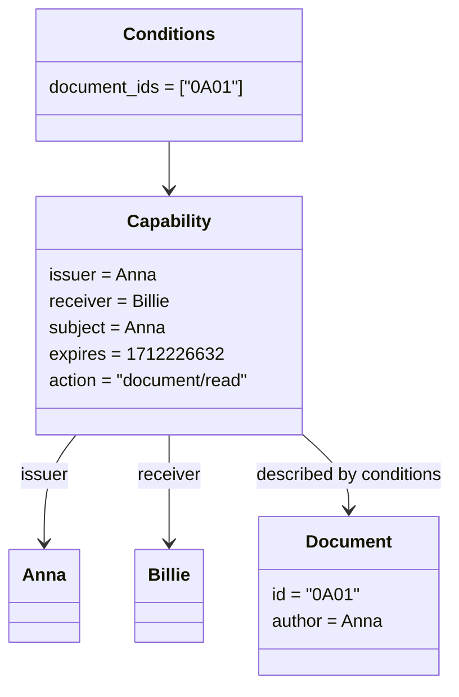

In the above example Anna issues a capability to Billie which gives the authority to read document `"0A01"`. It is valid from the moment it is issued as no `not_before` timestamp is included, it expires after timestamp `1712226632` has passed.

# Delegation

Once a peer has received a capability they can then delegate new capabilities based on the authority they received.

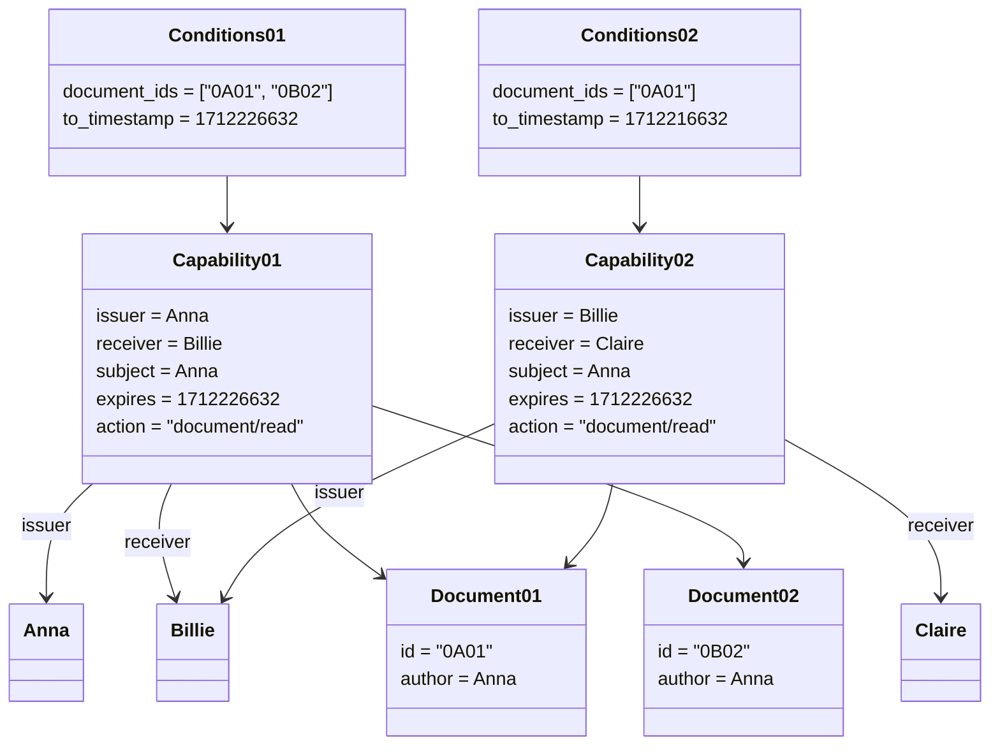

In the above example we see a read capability being issued from Anna to Billie for documents `"0A01"` and `"0B02"`, Billie then delegates read a capability to Claire only covering document `"0A01"`.

Peers can only delegate authority "less than" that which they have been given. The bounds of a peers authority is defined by the `not_before`, `expires` and `conditions` fields of capabilities they have been given. `not_before` must only increase, `expires` must only decrease and `conditions` must only attenuate the scope of authority given. Once a condition is included in a capability, it can be attenuated, but cannot be omitted in further delegations.

# Revocation

| Field    | Type   | Required | Description                                      |
| -------- | ------ | -------- | ------------------------------------------------ |
| `revoke` | `Hash` | Yes      | The operation id of the capability being revoked |

Due to the nature of distributed systems, it is not possible to offer a guaranteed solution for global data removal. The best effort we can offer is that if all peers correctly follow protocol and messages effectively replicate across the network, then data removal can eventually be achieved. This is also true when considering the revocation of previously issued capabilities, and is why employing sensible capability expiry and restricted access (following principle of least authority) should be the preferred method for securing access control in distributed systems.

Revocation offers a manual approach to invalidating previously issued capabilities. Our design is based on the [UCAN revocation specification](https://github.com/ucan-wg/revocation/blob/first-draft/README.md) which should be referred to for detailed descriptions of expected behavior.

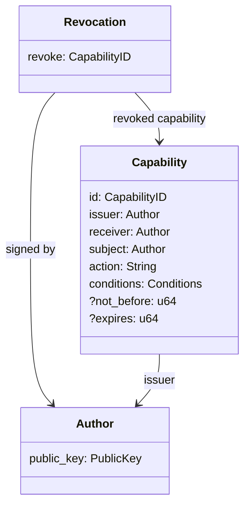

If the desired behavior is that actions already authorized under the to-be-revoked capability be retained (only new ones are rejected) then before revocation occurs a new capability covering the new, more restrictive, range should first be issued.

# Format

Capabilities and revocations are published as the body of a p2panda operation, specification [here](https://p2panda.org/specifications/namakemono).

A capability operation which has the schema id `cap_v1`.

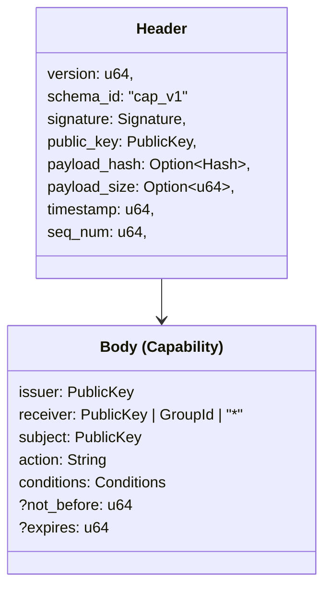

A revoke operation which has the schema id `revoke_v1`.

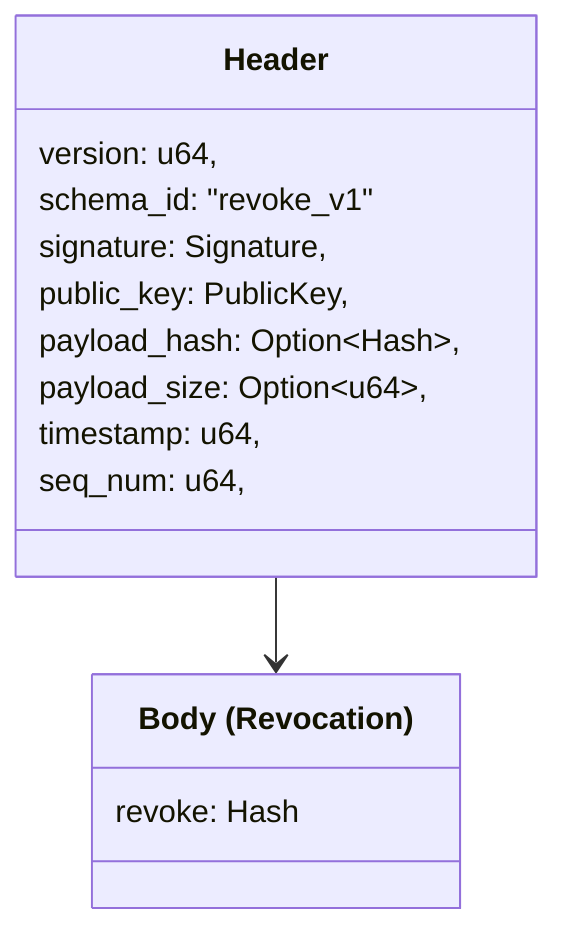

# Validation

Validation of capabilities must be performed by an authorizer before any new operation arriving at a peer, or any sync request, is authorized.

If any of the following criteria are not met, the capability must be considered invalid:

## Time Bounds

The system time must not be earlier than `not_before` or have passed the `expires` timestamp. Any new sync requests attempting to use this capability to read documents must be rejected and no operations relying on this capability for authority to perform an action must be rejected.

In the case of any `write` capabilities expiring, a peer can choose to keep already accepted operations which rely on this capabilities authority after expiry has passed, or where possible, roll back these changes and remove the operations. Which approach is taken will depend on the desired behavior for the document.

## Condition Attenuation

Delegated conditions must not expand the scope of the capability it delegates from, it must only attenuate.

The following table gives some examples of valid and invalid delegated conditions.

| Received Conditions                                | Delegated Conditions                               | Valid | Reason                                        |
| -------------------------------------------------- | -------------------------------------------------- | ----- | --------------------------------------------- |
| `{document_ids: ["0X01", "0X02"]}`                 | `{document_ids: ["0X01"]}`                         | ✅    | Condition is attenuated                       |
| `{schema_ids: ["events"]}`                         | `{schema_ids: ["events"], document_ids: ["0X01"]}` | ✅    | New condition added which restricts authority |
| `{from_timestamp: 10, to_timestamp: 100}`          | `{from_timestamp: 50, to_timestamp: 80}`           | ✅    | Condition is attenuated                       |
| `{schema_ids: ["events"], document_ids: ["0X01"]}` | `{schema_ids: ["events"]}`                         | ❌    | Condition removed                             |
| `{document_ids: ["0X01"]}`                         | `{document_ids: ["0X01", "0X02"]}`                 | ❌    | Condition expanded                            |
| `{from_timestamp: 50, to_timestamp: 80}`           | `{from_timestamp: 0, to_timestamp: 100}`           | ❌    | Condition expanded                            |

## Principal Alignment

In delegation, the `receiver` field of every proof must match the `issuer` field of the capability being delegated to. This alignment must form a chain back to the `subject` for each resource.

## Issuer Validation

The issuer field must match against the public key from the operation header.

# Authorization

Valid capabilities are used to authorize two main classes of action: read and write. Read actions result in operations being sent to other peers, while write actions involve a peer accepting and applying operations. This occurs during a sync session between two peers or when a client is making requests to a shared node.

## Read authority

Read requests are considered authorized if a valid read capability exists where the requesting peer is the `receiver` of the capability and the document being syncronised is included in it's authority scope. Only operations within the `from_timestamp` to `to_timestamp` range must be included.

It is worth noting that operations by _all_ authors who have contributed to this document will be syncronised, not only those of the capability `issuer`.

These check can be performed against a capability store or alternatively as a performance optimisation an access-control list can be maintained based on all known (not expired or revoked) capabilities.

## Write authority

Write requests are considered authorized if a valid read capability exists where the author of the operation is the `receiver` of the capability and the document being syncronised is included in it's authority scope. Only operations within the `from_timestamp` to `to_timestamp` and `from_seq` to `to_seq` ranges must be included.

These check can be performed against a capability store or alternatively as a performance optimisation an access-control list can be maintained based on all known (not expired or revoked) capabilities.

# Implementation

## Handling expired capabilities

When a capability a peer holds expires it signals that the authority previously delegated by the token should now be considered invalidated. This has several consequences: a peer may hold in it's store operations which have lost authorization (due to the expiry date passing) and other peers would now reject these operations if sent during a sync session.

Once a capability expires it may or may not be possible/desireable to "roll-back" any operations which were previously accepted under this authority. This depends on the nature of the target document. If no history is persisted then roll-back is likely not possible or expected, if however the document contained operations of a history-retaining CRDT tracking group membership, it may be desireable to drop any changes made by the now "not authorized" author. If the intention is that their historic changes should be retained then a new capability should have been issued already.

How likely this situation is to occur also depends on the desired network delay tolerance. For example, on a highly connected network where a documents' payload is a Yjs CRDT and only the most recent operation (depth 1, no history is kept) is retained then regularly issued capabilities will likely already be rendered redundant by ambient garbage collection before they expire. A contrasting example is that of a highly delay tolerant network, where entire document histories are retained, if a full network partition occurs then intended capability re-issues may not be received, in this situation peers may well choose to not yet roll-back the now invalidated operations even though they can no longer be replicated (until re-issued capabilities arrive).

## Handling revoked capabilities

When receiving a revocation message the capability it revokes must immediately be invalidated. Where possible previously authorized operations can be rolled back.

In order to ensure a deterministic revocation point the revocation can be appended to the document(s) which are the target of the revoked capability.

## Supporting protocol features

The features of the capability system described so far in this document can be implemented and supported in incremental stages. The initial layer would be
the mechanisms for issuing, storing and validating requests against issued capabilities. On top of this, revocation can be optionally supported.

## Distribution

Capabilities can be distributed ahead of synchronizing any other application data or sent at the start of a synchronization session. Which approach should be taken may depend on your use case and how sensitive metadata contained in the capabilities is considered to be. Revocation messages must be distributed to all relevant peers regardless of the approach taken for capabilities.

## Handling dependencies

Dependencies exist between messages in our capability system (revocations refer to a capability, capabilities may require a delegation chain), as messages may travel between peers on the network out-of-order, mechanisms for processing messages in the correct order are required. This is a common requirement of p2p systems and p2panda has existing solutions for ordering collections of operations correctly. In our implementation we can rely on existing patterns around handling relations between documents and deterministically ordering operation graphs within one document.

## Examples

### authorize `read` request against sent capability

Here a peer makes a `read` request and sends the authorizing capability in the request. The authorizer can validate the capability and the send delegation chain to ensure the authority it gives includes the requested document.

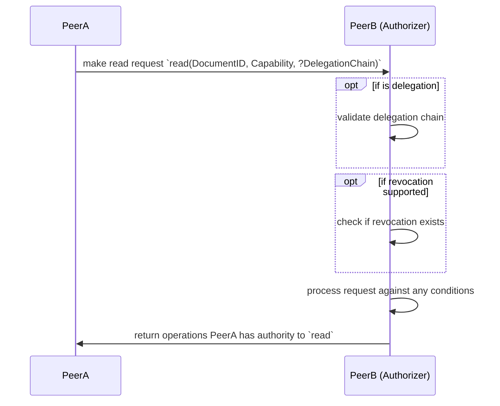

### authorize `read` request against cached capabilities (ACL)

If capabilities are cached (likely in the form of an Access Control List) then relevant capabilities do not need to be sent and the authorizer can simply query the ACL to check the requesting peer has the necessary authority.

In this example validation of capabilities, their delegation chains, and any existing revocations has already been performed and we can consider the ACL to be our current view of known peer authority mappings.

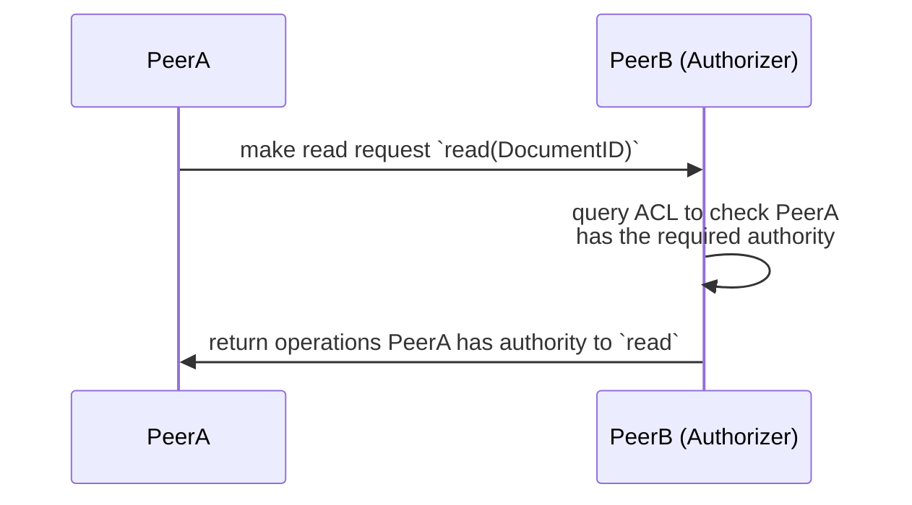

### authorize `write` / `delete` operations

In the above `read` examples the "invoker" of the capability was also the peer who received authority through it (the authority to read/sync operations of a document). In the case of capabilities which give authority to mutate documents (`write`, `delete`, etc..), this may not be the case. It will be common that the "invoker" of a capability (ie. the peer sending operations as part of a sync session) is not actually the receiver of the capability.

This example uses an local ACL to establish authority, but peers could also include all required capabilities in the sync request.

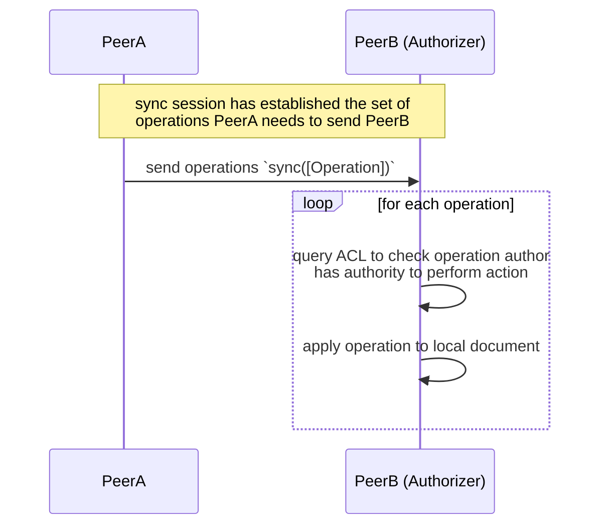

# Use Cases

## A personal travel blog

Anna is starting a travel blog which she wants to share with only her friends and family. Billie is a close friend that Anna trusts and so she issues a `document/read` capability with no expiry date (`1`). Billie can now read all entries in the travel blog document (`2`). Claire is a mutual friend of Anna and Billie, she lives in the town Anna is visiting but can't contact her and so asks Billie if they can give her access to the travel blog, Billie delegates the capability they hold for a temporary period (`3`). Now Claire can read the blog entries Billie holds (`4`), and also any new ones Claire publishes (`5`). Further attempts to read new blog entries after the `read` capability has expired will fail (`6`).

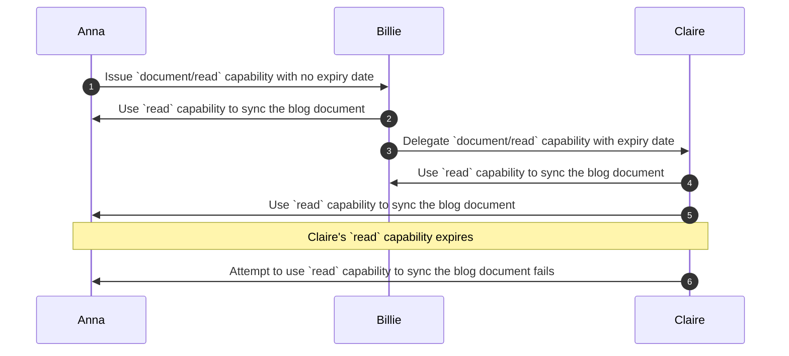

## Collaborative document

Anna is having a meeting with Billie and Claire, she starts a collaborative document where they can all help to record the minutes. She shares `read` and `write` authority with them both at the start of the meeting (`1` & `2`). During the meeting they can all edit the document (`3`). The `write` capability expires once the meeting ends, but read capabilities last longer so that the document can still be viewed and discussed later.

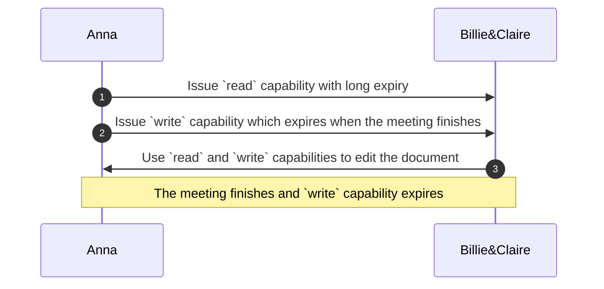

## Collaborative offline-first maps

Here we have a collaborative offline-first application where users can drop pins at points-of-interest on a map. Each map is maintained by an admin group, who can invite new collaborators and moderate content.

`AdminGroup` invites Daisy to join a map and issues them an `collection/add` capability (`1`) on the maps associated collection of `pins`. Daisy can now add her pins to the map. To use the app Daisy is expected to give the admin group authority to edit her pins. She does this by issuing a `document/write` capability restricted to documents of type `PIN_SCHEMA_ID` to the admin group (`2`).

Daisy could revoke the authority given to the AdminGroup at a later point, the admin group would then potentially revoke her right to add pins to the map.

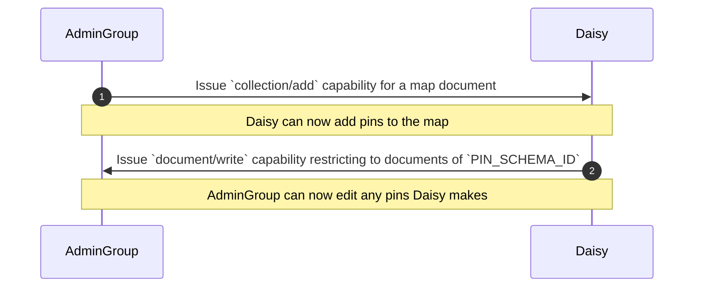

# Related projects

As previously stated, the capability system described in this document is heavily based of the UCAN specification (in-progress `v1.0.0` spec). That said, there were also many other projects which inspired these designs: [CapTP](https://spritelyproject.org/news/what-is-captp.html), [Spritely](https://spritely.institute/), [Biscuit](https://www.biscuitsec.org/), [Willow](https://willowprotocol.org/), [Cap'N'Proto](https://capnproto.org/) and [Cable](https://github.com/cabal-club/cable) to name a few.

## UCAN format comparison

If you're familiar with UCAN tokens, then it may be useful to see a side-by-side capability definition.

### `p2panda` capability

```json
{
  "issuer": "zDnaerDaTF5BXEavCrfRZEk316dpbLsfPDZ3WJ5hRTPFU2169",
  "receiver": "z6MkrZ1r5XBFZjBU34qyD8fueMbMRkKw17BZaq2ivKFjnz2z",
  "subject": "zDnaerDaTF5BXEavCrfRZEk316dpbLsfPDZ3WJ5hRTPFU2169",
  "action": "document/write",
  "conditions": {
    "document_ids": [
      "c2500c3088b01a98f4a7cfdab6037371ac64d4b929d4677daf39a3aa0c257612"
    ],
    "to_timestamp": 1712226632
  },
  "expires": 1712226632
}
```

### `UCAN` capability

```json
{
  "iss": "did:key:zDnaerDaTF5BXEavCrfRZEk316dpbLsfPDZ3WJ5hRTPFU2169",
  "aud": "did:key:z6MkrZ1r5XBFZjBU34qyD8fueMbMRkKw17BZaq2ivKFjnz2z",
  "sub": "did:key:zDnaerDaTF5BXEavCrfRZEk316dpbLsfPDZ3WJ5hRTPFU2169",
  "can": "document/write",
  "cond": [
    {
      "field": "document_id",
      "is_in": [
        "c2500c3088b01a98f4a7cfdab6037371ac64d4b929d4677daf39a3aa0c257612"
      ]
    },
    {
      "field": "timestamp",
      "lt": 1712226632
    }
  ],
  "exp": 1712226632
}
```

## Supported by

This work would not have been possible without the generous support of the [NLNet Foundation](https://nlnet.nl/) under the [NGI Zero Entrust](https://nlnet.nl/entrust/) funding scheme.

<br />
